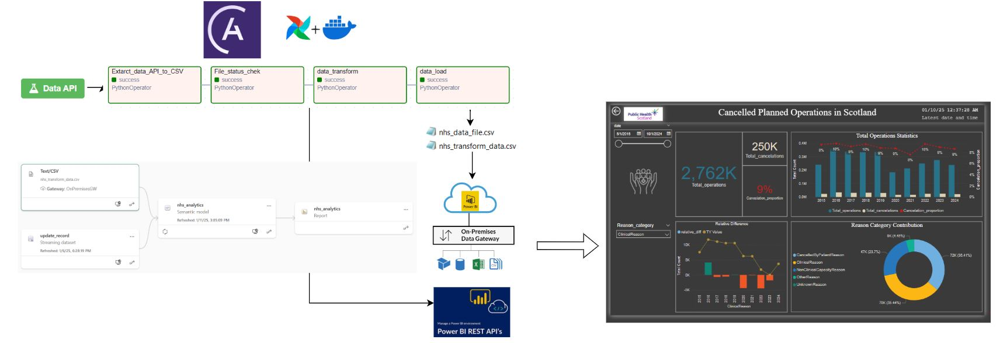
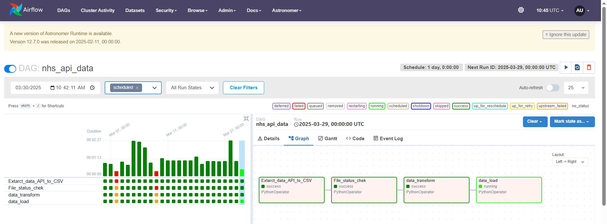
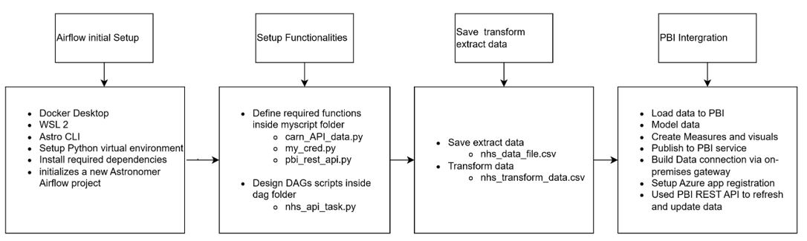
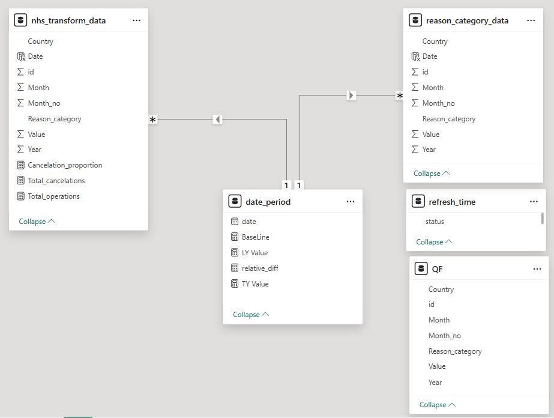

# NHS Cancelled Operations Analytics Project | Power BI Dashboard & ETL Pipeline Automation

## Introduction
This project automates the extraction, transformation, and loading (ETL) of NHS Open Data into Power BI for near real-time analytics. The pipeline is built using Apache Airflow, Python, and the Power BI REST API, ensuring a fully automated data pipeline that refreshes the Power BI dataset on a scheduled basis.

## Architecture

## Technology Used
1. Programming Language - Python
2. WSL2 - Windows Subsystem for Linux
3. Astro CLI
4. Docker Desktop
5. Power BI
    - Desktop: Create Dashboard and Data Modeling
    - Service: Publish Report 
    - Rest API: Refresh and Update Data Programmetrically
6. Azure Active Directory (AD) for App Registration
7. On-premises Data Gateway: Connect to On-premises data source
## Dataset Used
  - [Dataset](https://www.opendata.nhs.scot/dataset/cancelled-planned-operations/resource/df65826d-0017-455b-b312-828e47df325b)
  - [API guide](https://docs.ckan.org/en/latest/api/index.html)

## ETL workflow Diagram

This project automates an end-to-end ETL pipeline using Apache Airflow to extract, transform, and load NHS data into Power BI. The DAG (nhs_api_data) fetches data from an API with pagination support, ensuring full data retrieval. It validates the file size before processing; if the file doesn't meet the threshold, downstream tasks are skipped using AirflowSkipException. The data is then transformed with Pandas, reshaped, and prepared for analysis. The pipeline updates Power BI datasets by sending a real-time timestamp and triggering a dataset refresh with secure authentication via MSAL. Logs are generated at each stage, ensuring full traceability, transparency, and error tracking. This approach provides a scalable, efficient pipeline for near real-time insights

## Deployment 

## Data Model

## Functions and DAGs scripts
| function       | Link                                         |
| -------------- | -------------------------------------------- | 
| DAGs           | [nhs_api_task](9_nhs_api_task.py)            | 
| API request    | [carn_API_data](6_carn_API_data.py)          | 
| Credentials    | [my_cred](7_my_cred.py)                      |         
| PBI REST API   | [pbi_rest_api](8_pbi_rest_api.py)            |
